# Cognitive Architecture Comprehensive Analysis 🧠

**Document Version:** 1.0  
**Date:** 2025-08-15  
**Status:** Complete  

## 📋 **Overview**

This document provides a comprehensive analysis of the Smart Personal Planner's cognitive architecture, detailing the complete flow sequence, key components, and integration points that enable AI-driven scheduling with learning capabilities.

---

## 📁 **Architecture Structure**

```
app/cognitive/
├── contracts/           # 📋 API Contracts & Type Definitions
│   ├── types.py        # Core planning contracts (GoalSpec, PlanOutline, etc.)
│   └── __init__.py
├── memory/             # 🧠 Memory & Learning Systems  
│   ├── semantic.py     # AI learning & pattern recognition
│   ├── schemas.py      # Database memory models
│   ├── storage.py      # Database operations
│   └── __init__.py
├── world/              # 🌍 World State Management
│   ├── state.py        # World state models & schemas
│   ├── updater.py      # Core state update engine
│   ├── query.py        # Intelligent slot finding & queries
│   ├── validator.py    # Conflict detection & validation
│   ├── models.py       # ORM models for world persistence
│   └── __init__.py
├── langgraph_tools.py  # 🤖 AI Agent Tool Interface
└── memory.py           # (empty - legacy file)
```

### **Component Responsibilities**

| Component | Purpose | Key Classes/Functions |
|-----------|---------|----------------------|
| **contracts/** | Type definitions and API contracts | `GoalSpec`, `PlanOutline`, `CalendarizedTask` |
| **memory/semantic.py** | AI learning and pattern recognition | `SemanticMemory`, `MemoryEntry`, `MemoryType` |
| **memory/schemas.py** | Database memory persistence | `MemoryORM`, `MemoryAssociation` |
| **world/state.py** | World state data models | `WorldState`, `CalendarizedTask`, `AvailabilityMap` |
| **world/updater.py** | Core state coordination engine | `WorldUpdater`, `UpdateResult`, `UndoOperation` |
| **world/query.py** | Intelligent slot discovery | `WorldQueryEngine`, `TimeSlot`, `SlotQuery` |
| **world/validator.py** | Conflict detection and validation | `WorldValidator`, `ValidationResult` |
| **langgraph_tools.py** | AI agent interface layer | `AddTaskTool`, `RemoveTaskTool`, `ApplyPlanTool` |

---

## 🔄 **Complete Flow Sequence**

### **Phase 1: AI Agent Request** 🤖 → 🛠️

**Entry Point:** `langgraph_tools.py`

```python
# Agent sends request
AddTaskTool.run(AddTaskInput(
    task_id="task_123",
    title="Write project proposal", 
    start_datetime="2025-08-15T09:00:00",
    end_datetime="2025-08-15T10:00:00"
))
```

**Key Functions:**
- `AddTaskTool.run()` - Add new task with observability
- `RemoveTaskTool.run()` - Remove existing task with logging
- `ApplyPlanTool.run()` - Apply complete plan atomically

**What Happens:**
1. **Input Validation**: Pydantic schemas validate request structure
2. **Performance Monitoring**: Timing and metrics collection starts
3. **Tool Invocation**: WorldUpdater called with structured data
4. **Error Handling**: Comprehensive error catching and reporting
5. **Response Formatting**: Results formatted for agent consumption

---

### **Phase 2: World State Coordination** 🌍 ⚙️

**Entry Point:** `world/updater.py → WorldUpdater`

```python
# Core coordination logic
def add_task(self, task: CalendarizedTask) -> UpdateResult:
    # 1. State backup for undo capability
    # 2. Validation and conflict detection  
    # 3. Database persistence
    # 4. World state updates
    # 5. Cache invalidation
    # 6. Semantic memory logging
```

**Key Methods:**
- `add_task()` - Core task addition with full lifecycle
- `remove_task()` - Safe task removal with impact analysis
- `apply_plan()` - Atomic plan application with rollback
- `_backup_state()` - Create restoration points
- `_find_alternative_slots()` - Intelligent conflict resolution
- `undo_last_operation()` - Complete state rollback

**What Happens:**
1. **State Backup**: Create undo point with complete state snapshot
2. **Validation Pipeline**: WorldValidator checks for conflicts
3. **Database Transaction**: Persist changes via ScheduledTask ORM
4. **World State Sync**: Update in-memory WorldState representation
5. **Impact Analysis**: Calculate affected dates, weeks, and dependencies
6. **Cache Management**: Invalidate affected query caches
7. **Learning Integration**: Log operation details for AI improvement

---

### **Phase 3: Conflict Detection & Validation** ⚠️ ✅

**Entry Point:** `world/validator.py → WorldValidator`

```python
# Validation pipeline
def validate_task(self, task: CalendarizedTask) -> ValidationResult:
    conflicts = []
    
    # Time overlap detection
    conflicts.extend(self.check_time_conflicts(task))
    
    # Capacity constraint validation  
    conflicts.extend(self.check_capacity_constraints(task))
    
    # User availability verification
    conflicts.extend(self.validate_availability(task))
    
    return ValidationResult(
        is_valid=len(conflicts) == 0,
        conflicts=conflicts
    )
```

**Key Methods:**
- `validate_task()` - Comprehensive conflict detection
- `check_time_conflicts()` - Temporal overlap analysis
- `check_capacity_constraints()` - Load limit validation
- `validate_availability()` - User schedule verification

**What Happens:**
1. **Time Conflict Analysis**: Detect overlapping scheduled tasks
2. **Capacity Validation**: Ensure daily/weekly workload limits
3. **Availability Check**: Verify against user's availability patterns
4. **Constraint Verification**: Check blackout periods and restrictions
5. **Result Compilation**: Generate detailed ValidationResult with suggestions

---

### **Phase 4: Intelligent Slot Finding** 🔍 📅

**Entry Point:** `world/query.py → WorldQueryEngine`

```python
# Smart slot discovery
def find_available_slots(self, query: SlotQuery) -> SlotQueryResult:
    # 1. Parse search parameters
    # 2. Scan availability patterns
    # 3. Generate candidate slots
    # 4. Apply semantic ranking
    # 5. Filter and prioritize results
```

**Key Methods:**
- `find_available_slots()` - Core slot discovery with ranking
- `find_next_free_slot()` - Next available time optimization
- `get_tasks_by_date()` - Date-specific task queries
- `get_capacity_stats()` - Load analysis and reporting

**What Happens:**
1. **Query Processing**: Parse SlotQuery parameters and constraints
2. **Availability Scanning**: Analyze user's time availability patterns
3. **Conflict Detection**: Identify occupied and restricted time slots
4. **Slot Generation**: Create TimeSlot objects for available periods
5. **Semantic Ranking**: Score slots by context (energy, focus, creativity)
6. **Result Optimization**: Apply filters, limits, and priority ordering

---

### **Phase 5: Data Persistence** 💾 🗃️

**Entry Point:** `world/models.py` and `app/models.py`

```python
# Data persistence flow
CalendarizedTask → CalendarizedTaskORM → ScheduledTask
                ↓
            Database Storage
                ↓
        Capacity Updates → CapacitySnapshot
```

**Key Classes:**
- `CalendarizedTaskORM` - World state persistence layer
- `ScheduledTask` - Primary task database model  
- `CapacitySnapshot` - Load tracking and historical data

**What Happens:**
1. **Model Conversion**: CalendarizedTask → ScheduledTask ORM mapping
2. **Transaction Management**: ACID-compliant database operations
3. **Capacity Updates**: Real-time load tracking and capacity snapshots
4. **Relationship Management**: Maintain task associations and dependencies
5. **Data Integrity**: Ensure consistency across related entities

---

### **Phase 6: AI Learning & Memory** 🧠 📊

**Entry Point:** `memory/semantic.py → SemanticMemory`

```python
# Learning and pattern recognition
def log_operation(self, operation_type: str, details: Dict) -> str:
    # Create memory entry with full context
    memory = MemoryEntry(
        memory_type=MemoryType.OPERATION,
        data=details,
        priority=MemoryPriority.MEDIUM
    )
    
    # Store for pattern analysis
    self._memory_store.append(memory)
```

**Key Methods:**
- `log_operation()` - Record system operations with context
- `log_user_preference()` - Capture and learn user patterns
- `log_ai_decision()` - Track AI reasoning and choices
- `log_user_feedback()` - Learn from user corrections
- `analyze_patterns()` - Extract behavioral insights

**What Happens:**
1. **Operation Logging**: Record all add/remove/update operations
2. **Context Capture**: Store operation details, reasoning, and outcomes
3. **Pattern Detection**: Analyze user behavior trends over time
4. **Preference Learning**: Extract scheduling preferences automatically
5. **Decision Tracking**: Monitor AI performance and accuracy
6. **Feedback Integration**: Learn from user corrections and adjustments

---

### **Phase 7: Database Memory Storage** 🗄️ 📝

**Entry Point:** `memory/storage.py` with `memory/schemas.py`

```python
# Long-term memory persistence
def write_memory(db: Session, memory: MemoryObject) -> str:
    orm_obj = MemoryORM(
        user_id=memory.user_id,
        type=memory.type,
        content=memory.content,
        metadata=memory.metadata
    )
    db.add(orm_obj)
    return str(orm_obj.memory_id)
```

**Key Functions:**
- `write_memory()` - Persist memory objects to database
- `retrieve_memory()` - Query memories by context and type
- **Models**: `MemoryORM`, `MemoryAssociation` for relationship tracking

**What Happens:**
1. **Memory Persistence**: Store semantic memories in relational database
2. **Association Tracking**: Link related memories and experiences
3. **Retrieval Optimization**: Efficient memory queries by type and context
4. **Long-term Storage**: Permanent retention for continuous learning

---

## 🎯 **Example Complete Flow**

### **Scenario**: Agent adds "Write project proposal" task

```mermaid
sequenceDiagram
    participant Agent as 🤖 LangGraph Agent
    participant Tools as 🛠️ LangGraph Tools  
    participant Updater as ⚙️ WorldUpdater
    participant Validator as ✅ Validator
    participant Query as 🔍 QueryEngine
    participant Memory as 🧠 SemanticMemory
    participant DB as 💾 Database

    Agent->>Tools: AddTaskTool("Write proposal", "2025-08-15 09:00")
    Tools->>Updater: add_task(CalendarizedTask)
    
    Updater->>Updater: _backup_state() for undo
    Updater->>Validator: validate_task(task)
    Validator->>Validator: check_time_conflicts()
    Validator->>Validator: check_capacity_constraints()
    Validator-->>Updater: ValidationResult(success=False, conflicts=["Meeting at 09:30"])
    
    Updater->>Query: find_available_slots(SlotQuery)
    Query->>Query: scan_availability_patterns()
    Query->>Query: generate_time_slots()
    Query-->>Updater: [TimeSlot(10:00-11:00), TimeSlot(14:00-15:00)]
    
    Updater->>Memory: log_operation("add_task", conflict_resolution_data)
    Memory->>DB: store memory with learning context
    
    Updater-->>Tools: UpdateResult(suggested_slots=[...])
    Tools-->>Agent: "Conflict found, suggested: 10:00-11:00 or 14:00-15:00"
```



### **Flow Breakdown:**

1. **Agent Request**: LangGraph agent requests task addition
2. **Tool Processing**: AddTaskTool validates and processes request
3. **State Management**: WorldUpdater creates backup and coordinates changes
4. **Conflict Detection**: Validator identifies scheduling conflict
5. **Alternative Finding**: QueryEngine discovers available time slots
6. **Learning**: SemanticMemory logs conflict resolution for future improvement
7. **Response**: Agent receives conflict notification with smart suggestions

---

## 🎮 **Key Integration Points**

### **1. Contract Layer** 📋
- **Purpose**: Type safety and API consistency across components
- **Key Models**: `GoalSpec`, `PlanOutline`, `CalendarizedTask`
- **Integration**: Ensures consistent data structures throughout the flow

### **2. World State Engine** 🌍
- **Purpose**: Central coordination hub for all scheduling operations
- **Key Classes**: `WorldState`, `WorldUpdater`, `WorldQueryEngine`
- **Integration**: Manages global task state with conflict resolution

### **3. Memory & Learning System** 🧠
- **Purpose**: Continuous AI improvement through pattern recognition
- **Key Classes**: `SemanticMemory`, `MemoryEntry`, `MemoryORM`
- **Integration**: Captures operational context for learning enhancement

### **4. Tool Interface Layer** 🤖
- **Purpose**: Clean AI agent interaction with comprehensive observability
- **Key Classes**: `AddTaskTool`, `RemoveTaskTool`, `ApplyPlanTool`
- **Integration**: Bridges LangGraph agents with core planning logic

---

## 🚀 **Advanced Features**

### **Conflict Resolution System** ⚔️

```python
# Intelligent conflict handling
if not validation_result.is_valid:
    # 1. Analyze conflict types
    # 2. Generate alternative slots
    # 3. Apply user preferences
    # 4. Rank suggestions by quality
    # 5. Return smart recommendations
    
    suggested_slots = self._find_alternative_slots(task)
    return UpdateResult(
        success=False,
        suggested_slots=suggested_slots,
        error_message="Conflict detected - alternatives provided"
    )
```

**Features:**
- **Smart Conflict Detection**: Multi-dimensional conflict analysis
- **Alternative Generation**: Intelligent slot recommendations
- **User Preference Integration**: Considers learned patterns
- **Quality Ranking**: Semantic scoring of suggestions

### **Undo/Redo System** ↩️

```python
# Complete state management
class UndoOperation:
    operation_id: int
    action: UpdateAction
    before_state: Dict  # Complete state snapshot
    after_state: Dict   # Post-operation state
    
# Rollback capability
def undo_last_operation(self) -> UpdateResult:
    last_op = self._undo_stack.pop()
    restored_state = WorldState(**last_op.before_state)
    # Restore complete world state
    self.world_state = restored_state
```

**Features:**
- **Complete State Snapshots**: Full world state preservation
- **Atomic Operations**: All-or-nothing operation guarantees
- **Stack Management**: LIFO undo operation ordering
- **State Restoration**: Complete rollback capability

### **Learning Loop** 🔄

```python
# Continuous improvement cycle
def learning_cycle():
    # 1. Log every operation with full context
    semantic_memory.log_operation(operation_type, {
        "task_data": task.dict(),
        "user_context": user_preferences,
        "decision_reasoning": reasoning,
        "alternatives_considered": alternatives
    })
    
    # 2. Analyze patterns periodically
    patterns = semantic_memory.analyze_patterns(days_back=30)
    
    # 3. Update recommendation algorithms
    query_engine.update_ranking_weights(patterns)
    
    # 4. Improve future suggestions
    validator.update_preference_rules(patterns)
```

**Features:**
- **Comprehensive Logging**: Full context capture for every operation
- **Pattern Recognition**: Automated user preference detection
- **Algorithm Updates**: Dynamic improvement of recommendation quality
- **Feedback Integration**: Learning from user corrections and choices

---

## 📊 **Performance Characteristics**

### **Scalability**
- **World State**: In-memory for fast access, database for persistence
- **Query Engine**: Cached results with intelligent invalidation
- **Memory System**: Efficient storage with configurable retention policies

### **Reliability**
- **Transaction Safety**: ACID compliance for all database operations
- **State Consistency**: Atomic operations with rollback capabilities
- **Error Handling**: Comprehensive error recovery and reporting

### **Observability**
- **Operation Tracking**: Complete audit trail of all changes
- **Performance Metrics**: Timing and resource usage monitoring
- **Learning Analytics**: AI decision tracking and improvement metrics

---

## 🔮 **Future Enhancement Opportunities**

### **Advanced AI Features**
- **Predictive Scheduling**: Learn optimal scheduling patterns
- **Context Awareness**: Integrate calendar events and external factors
- **Adaptive Preferences**: Dynamic preference learning and adjustment

### **Integration Possibilities**
- **External Calendars**: Google Calendar, Outlook synchronization
- **Team Coordination**: Multi-user scheduling and collaboration
- **Resource Management**: Equipment, room, and resource booking

### **Performance Optimizations**
- **Distributed Caching**: Redis integration for query result caching
- **Async Processing**: Background task processing for heavy operations
- **ML Integration**: Advanced pattern recognition with machine learning

---

## 📝 **Summary**

The Smart Personal Planner's cognitive architecture provides a **comprehensive AI-driven scheduling system** with the following key capabilities:

✅ **Intelligent Conflict Resolution** - Smart detection and alternative suggestions  
✅ **Learning & Adaptation** - Continuous improvement through user interaction  
✅ **State Management** - Robust undo/redo with complete state preservation  
✅ **Performance & Scalability** - Efficient caching and database optimization  
✅ **Comprehensive Observability** - Full operation tracking and analytics  

This architecture enables sophisticated scheduling assistance that **learns from user behavior**, **resolves conflicts intelligently**, and **continuously improves** its recommendations over time.

---

**Document Metadata:**
- **Author**: AI Assistant Analysis
- **Date**: 2025-08-15
- **Version**: 1.0
- **Related Files**: All files in `app/cognitive/` directory
- **Next Review**: When major architectural changes are made
